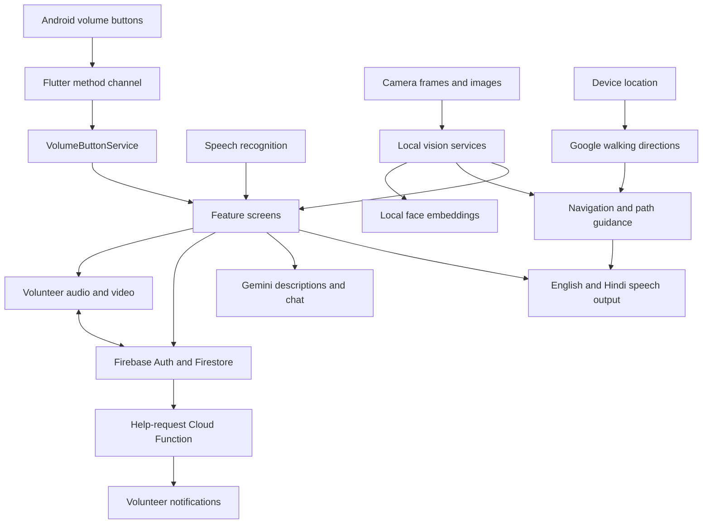

# Tisra Netra architecture

This overview describes the current source. The [Architecture and Project report.md](Architecture%20and%20Project%20report.md) contains detailed feature analysis; historical names/details in that report may predate the current implementation.

## Components

| Area | Source | Responsibility |
| --- | --- | --- |
| Startup | [lib/main.dart](lib/main.dart) | Initializes Firebase/FCM, loads the user's language, and starts the app. |
| UI | [lib/screens/](lib/screens/) | Home, authentication, camera features, navigation, AI Buddy, and calls. |
| Accessibility | [VolumeButtonService](lib/services/volume_button_service.dart), [TtsService](lib/services/tts_service.dart), [LanguagePreferenceService](lib/services/language_preference_service.dart) | Active-screen hardware callbacks and English/Hindi speech. |
| Vision | [lib/services/](lib/services/), [assets/models/](assets/models/) | ML Kit recognition, TFLite inference, depth estimation, color sampling, and cloud-assisted descriptions. |
| Navigation | [NavigationService](lib/services/navigation_service.dart), [PathAnalyzerService](lib/services/path_analyzer_service.dart), [DepthEstimationService](lib/services/depth_estimation_service.dart) | Walking routes, progress/rerouting, and visual path guidance. |
| Local storage | [FaceDBService](lib/services/face_db_service.dart) | SQLite `faces.db` stores names and face-embedding vectors. |
| Volunteer calls | [SignalingService](lib/services/signaling_service.dart), [FcmService](lib/services/fcm_service.dart), [functions/index.js](functions/index.js) | Firestore signaling, WebRTC, and push delivery. |

## Main flows

### Hardware and voice

Android's [MainActivity](android/app/src/main/kotlin/com/futureluck/tisranetrta/MainActivity.kt) forwards volume events over `com.percive.app/volumebutton`. `VolumeButtonService` maintains a stack: the most recently registered screen receives events, and disposing it restores the previous screen. Each screen decides whether a button starts listening, scans, repeats, cancels, or goes back. See the [controls guide](VOLUME_BUTTON_GUIDE.md).

### Camera and navigation

OCR, currency recognition, color sampling, and face embeddings run locally. Navigation combines GPS Directions responses with SSD MobileNet detection, MiDaS depth estimation where available, and path analysis. Gemini provides cloud object/scene descriptions and AI Buddy responses. Local inference does not require Gemini credentials; cloud requests do.

### Volunteer assistance

1. A signed-in client creates `help_requests/{requestId}` with `clientId`, `clientName`, `status: pending`, and a timestamp.
2. The Cloud Function queries `users` with `userType: Volunteer` and sends notifications to saved `fcmToken` values.
3. Client/volunteer exchange WebRTC offers, answers, controls, and ICE candidates through the request's `signaling` subcollection. Candidate items live under `signaling/candidates_data/items`.
4. WebRTC carries media; Firestore carries signaling and request state. Status can become `accepted`, `ended`, or `cancelled`.

Profiles live in `users/{firebaseAuthUid}` and include role, name, language, emergency contact, and notification token. Face embeddings remain separately in local SQLite.

## Configuration boundaries

Firebase project identifiers live in `lib/firebase_options.dart`, `android/app/google-services.json.template`, and `.firebaserc`. API keys and relay credentials live in ignored `.env`. Dart reads compile-time defines; Gradle fills the Android manifest and generates an ignored Firebase JSON from the template. The [import tool](tool/import_firebase_config.dart) migrates freshly generated FlutterFire keys into `.env`. See [environment setup](README.md#environment-variables).

Android is the configured platform. Tests cover navigation wording, hardware-event routing, and Firebase configuration imports; the [manual checklist](samples/README.md) covers live camera, speech, GPS, and calls.
