# Tisra Netra — Comprehensive Architecture & Feature Analysis Report

> **Project Name:** Tisra Netra 
> **Target Audience:** Visually impaired individuals & community volunteers  
> **Tech Stack:** Flutter, Dart, Firebase, TensorFlow Lite, Google ML Kit, WebRTC, Gemini AI  
> **Accessibility Standard:** Hardware Volume Key Navigation, Dual Language (English + Hindi), Hands-free Voice Command Loop  

---

## 1. Executive Summary & Core Architectural Vision

**Tisra Netra ** is an advanced, AI-powered accessibility platform created to empower blind and visually impaired users with real-time environmental awareness, turn-by-turn navigation, object/person identification, document reading, and instant volunteer video assistance.

### Key Architectural Pillars
1. **Hardware-First Accessibility:** Operates without requiring touch screen sight. Hardware Volume Up triggers voice command listening; Volume Down functions as back/cancel/status readout.
2. **Dual-Layer Navigation Architecture:** Merges high-precision GPS walking directions (Google Maps Directions API) with real-time, on-device computer vision obstacle detection and depth estimation.
3. **On-Device Computer Vision & Machine Learning:** Runs quantized TensorFlow Lite models (SSD MobileNet v2, MobileFaceNet) and Google ML Kit on background Dart isolates for ultra-low latency inference without network dependency.
4. **Bilingual Intelligence:** Native support for English and Hindi across STT (Speech-to-Text), TTS (Text-to-Speech), and voice command matching.
5. **Real-time Volunteer Network:** Peer-to-peer WebRTC video calling system backed by Firebase Firestore signaling and Firebase Cloud Messaging (FCM).

---

## 2. Global System Architecture

```mermaid
graph TD
    subgraph Client Application Layer [Flutter UI & State Layer]
        HS[HomeScreen]
        NS[NavigateScreen]
        RBS[ReadAnythingScreen]
        CS[CurrencyScreen]
        ORS[ObjectRecognitionScreen]
        SCS[SceneCaptioningScreen]
        PIS[PersonIdentificationScreen]
        CLS[ColorScreen]
        TVS[TalkWithVoluntaryScreen]
        VCS[VideoCallScreen]
        ABS[AIBuddyScreen]
        EMS[EmergencyScreen]
    end

    subgraph Accessibility & Hardware Control
        VBS[VolumeButtonService / VolumeButtonMixin]
        TTS[TtsService - English & Hindi]
        STT[SpeechToText Engine]
        LPS[LanguagePreferenceService]
    end

    subgraph Machine Learning & Computer Vision Services
        NODS[NavObjectDetectionService - SSD MobileNet v2]
        DES[DepthEstimationService - BBox Proximity Engine]
        PAS[PathAnalyzerService - 3-Zone Spatial Corridor]
        FES[FaceEmbeddingService - MobileFaceNet]
        FDBS[FaceDBService - SQLite Storage]
        SLS[SceneLabelingService - ML Kit / Structural Blocker]
    end

    subgraph Cloud & Remote Services
        GDM[Google Directions API - Walking Mode]
        GAI[Google Generative AI - Gemini 3 Flash]
        FBA[Firebase Auth & Cloud Firestore]
        FCM[Firebase Cloud Messaging - Push Alerts]
        WTC[WebRTC Peer Connection & ICE Candidates]
    end

    HS --> VBS
    HS --> STT
    HS --> TTS

    NS --> NODS
    NS --> DES
    NS --> PAS
    NS --> FES
    NS --> GDM

    PIS --> FES
    PIS --> FDBS

    TVS --> WTC
    TVS --> FCM
    VCS --> WTC

    ABS --> GAI
```



---

## 3. Deep-Dive: Navigation Module (`NavigateScreen` & Associated Services)

The **Navigation Module** is the centerpiece of Tisra Netra. It solves the critical safety problem of traditional GPS apps: GPS knows *where roads are*, but cannot see *temporary obstacles, parked vehicles, low-hanging branches, walls, or open doors*.

### 3.1 Architecture Overview

The navigation system is divided into **Two Primary Modes**:

```
                              ┌──────────────────────────────────────────┐
                              │            NavigateScreen                │
                              └────────────────────┬─────────────────────┘
                                                   │
                         ┌─────────────────────────┴─────────────────────────┐
                         ▼                                                   ▼
             ┌───────────────────────┐                           ┌───────────────────────┐
             │       Walk Mode       │                           │   Destination Mode    │
             └───────────┬───────────┘                           └───────────┬───────────┘
                         │                                                   │
  Real-time Camera Obstacle Detection                        GPS Walking Route (Google Directions API)
  + Bounding Box Depth Estimation                            + Turn-by-Turn Voice Announcements
  + 3-Zone Spatial Path Analyzer                             + Dynamic Rerouting (>40m deviation)
  + Face Identification Integration                          + Real-Time Visual Hazard Overlay
```

---

### 3.2 Navigation Core Components & Algorithms

#### 1. `NavigationService` ([navigation_service.dart](file:///c:/Users/abhim/OneDrive/Desktop/Projects/LifeLense/lib/services/navigation_service.dart))
- **Directions API Fetcher:** Queries Google Maps Directions API (`mode=walking`) and parses HTML instructions into clean plain text and Hindi equivalents.
- **Progressive Distance Announcements:** Spoken alerts triggered at distance thresholds: **200m → 100m → 50m → 30m → 15m**.
- **Turn Approach Warnings:** Detects when the user is within 30 meters of a turn and announces: *"Prepare to turn left"*.
- **Dynamic Off-Route Rerouting:**
  - Calculates perpendicular distance from current GPS coordinate to active route line segment using vector projection (`_distanceToSegment`).
  - Triggers automatic route recalculation when deviation exceeds **40 meters**, throttled to once every 20 seconds.
- **Live ETA Engine:** Computes remaining distance via Haversine formula and estimates arrival time based on an average walking speed of **1.2 m/s**.

#### 2. `NavObjectDetectionService` ([nav_object_detection_service.dart](file:///c:/Users/abhim/OneDrive/Desktop/Projects/LifeLense/lib/services/nav_object_detection_service.dart))
- **Model:** Quantized `ssd_mobilenet_v2.tflite` (300x300 input, uint8).
- **Background Isolate Processing:** `processCameraImageIsolate` converts YUV420 camera frames to RGB, performs sensor orientation rotation, and resizes without blocking the Flutter UI looper thread.
- **Danger Level Classification:**
  - `Critical`: Immediate vehicle / collision threats (`car`, `truck`, `bus`, `motorcycle`, `person`).
  - `Warning`: Static walking obstacles (`bench`, `chair`, `potted plant`, `fire hydrant`, `dog`, `backpack`).
  - `Info`: General background labels.

#### 3. `DepthEstimationService` ([depth_estimation_service.dart](file:///c:/Users/abhim/OneDrive/Desktop/Projects/LifeLense/lib/services/depth_estimation_service.dart))
- **Bounding Box Heuristics:** Calculates object distance in meters by analyzing the normalized height fraction of the bounding box relative to COCO reference heights (e.g., standard height of a person = 1.7m, car = 1.5m, chair = 0.9m).
- **Proximity Zones:**
  - `Very Close` (< 1.5m)
  - `Close` (1.5m - 3.0m)
  - `Near` (3.0m - 5.0m)
  - `Far` (> 5.0m)

#### 4. `PathAnalyzerService` ([path_analyzer_service.dart](file:///c:/Users/abhim/OneDrive/Desktop/Projects/LifeLense/lib/services/path_analyzer_service.dart))
- **3-Zone Spatial Grid:** Divides camera view horizontally into **Left** (0 - 33%), **Center** (33 - 66%), and **Right** (66 - 100%).
- **Dynamic Walkable Path Boundary (`PathBoundary`):** Derives `leftLineX` and `rightLineX` normalized boundaries, defining a visual safe corridor overlay for low-vision users.
- **Structural Blocker Overrides:** Identifies solid obstacles like **doors** or **walls** from `SceneLabelingService` and issues immediate redirection commands (*"Door in front of you. Open the door"*).
- **Voice Urgency Controller:**

| Urgency Level | Trigger Condition | Speech Rate & Behavior |
| :--- | :--- | :--- |
| `VoiceUrgency.critical` | Distance < 1.5m or Critical Obstacle | 1.5s cooldown, elevated pitch, fast repeat alert |
| `VoiceUrgency.high` | Warning obstacle ahead | 2.5s cooldown, slightly fast speech |
| `VoiceUrgency.medium` | Center path partially blocked | 4.0s cooldown, standard speech |
| `VoiceUrgency.low` | Clear path / Info objects | 10.0s cooldown, suppressed repetition |

---

### 3.3 Destination Mode Safety Intercept Mechanism

In **Destination Mode**, GPS instructions and visual safety alerts could conflict if both speak simultaneously. Tisra Netra resolves this with a **Safety Intercept Hierarchy**:

```
                       [ Incoming Camera Frame ]
                                   │
                                   ▼
                      [ PathAnalyzer Processing ]
                                   │
                    ┌──────────────┴──────────────┐
                    ▼                             ▼
       Urgency = Critical / High       Urgency = Medium / Low
                    │                             │
                    ▼                             ▼
          [ Suppress GPS Voice ]              [ Allow GPS Route ]
       Speak Safety Alert Immediately     Spoken Turn-by-Turn Instruction
```

---

## 4. Comprehensive Screen & Feature Breakdown

### 4.1 Read Anything Screen (`ReadAnythingScreen`)
- **Primary Function:** Instant reading of printed or handwritten text (labels, documents, signs, medicine boxes).
- **Implementation:**
  - Uses `google_mlkit_text_recognition` for on-device OCR.
  - Camera stream captures text blocks, orders them topologically (top-to-bottom, left-to-right), and highlights them visually.
  - Integrated full-screen tap / volume down to pause, resume, or replay text reading.

### 4.2 Currency Recognition Screen (`CurrencyScreen`)
- **Primary Function:** Identification of Indian Rupee (INR) currency notes for financial independence.
- **Implementation:**
  - Combines `google_mlkit_image_labeling` with custom aspect-ratio and color feature analysis.
  - Recognizes denominations: **₹10, ₹20, ₹50, ₹100, ₹200, ₹500, ₹2000**.
  - Speaks denomination immediately in English or Hindi (e.g., *"Five hundred rupees note detected"* / *"पाँच सौ रुपये का नोट"*).

### 4.3 Object Recognition Screen (`ObjectRecognitionScreen`)
- **Primary Function:** General object discovery around the user's environment.
- **Implementation:**
  - Runs continuous inference using `NavObjectDetectionService` (SSD MobileNet v2).
  - Displays bounding boxes with confidence scores on screen while announcing objects based on confidence threshold (> 50%).

### 4.4 Understand Environment Screen (`SceneCaptioningScreen`)
- **Primary Function:** Generates detailed natural language descriptions of complex visual scenes.
- **Implementation:**
  - Captures high-resolution snapshot from camera and dispatches it to **Google Generative AI (Gemini Flash)**.
  - Prompt engineered specifically for blind navigation assistance: *"Describe this scene concisely for a visually impaired person, focusing on terrain, main subjects, hazards, and layout."*
  - Fallback mode uses ML Kit image labeling if offline.

### 4.5 Person Identification Screen (`PersonIdentificationScreen`)
- **Primary Function:** Recognizes known family members, friends, or caregivers and alerts the user by name.
- **Implementation:**
  - **Registration Phase:** Captures 3 distinct face angles, runs ML Kit face detection, extracts 128-dimensional feature vectors via `mobile_facenet.tflite`, and stores them in SQLite (`FaceDBService`).
  - **Recognition Phase:** Real-time facial bounding box cropping, cosine similarity matching against stored embeddings (threshold = `0.6`), and automatic voice announcement (*"Abhimaan ahead"*).

### 4.6 Color Detection Screen (`ColorScreen`)
- **Primary Function:** Identifies clothing colors, room lighting, or item colors.
- **Implementation:**
  - Samples pixel grid at camera center, converts RGB values into **HSV / HSL color space**.
  - Maps hue, saturation, and value to human-friendly color names (e.g., *Navy Blue, Crimson Red, Olive Green, Warm White*).

### 4.7 Talk with Volunteer & Video Call (`TalkWithVoluntaryScreen` & `VideoCallScreen`)
- **Primary Function:** Live audio-video streaming connection to sighted community volunteers when AI assistance is insufficient.
- **Implementation:**
  - **Signaling:** Uses `cloud_firestore` to create call request documents containing WebRTC SDP offers/answers and ICE candidates.
  - **Notifications:** `FcmService` sends high-priority Firebase Cloud Messages to registered volunteers.
  - **Media Streaming:** Established via `flutter_webrtc` for real-time bidirectional video and audio streaming.

### 4.8 AI Buddy Screen (`AIBuddyScreen`)
- **Primary Function:** Conversational AI companion for answering general questions, navigation help, or entertainment.
- **Implementation:**
  - Uses `google_generative_ai` (`gemini-3-flash-preview`) with custom system instructions prohibiting markdown formatting, emojis, or bold text so TTS reads seamlessly.
  - Continuous speech-recognition-to-speech-synthesis loop triggered hands-free via volume keys.

### 4.9 Emergency SOS Screen (`EmergencyScreen`)
- **Primary Function:** Quick-action emergency helper for urgent situations.
- **Implementation:**
  - Fetches current GPS coordinates via `Geolocator`, reverse-geocodes into a physical street address via `Geocoding`.
  - Triggers direct phone call to registered emergency contact via `flutter_phone_direct_caller` and prepares SMS with live location coordinates.

### 4.10 Authentication & Profile Management (`RegistrationScreen`, `LoginScreen`, `ProfileScreen`)
- **Role-Based Auth:** Separates account types into **Visually Impaired User** and **Volunteer**.
- **Preferences:** Saves voice language selection (English vs. Hindi) to Firestore, automatically applied upon login.

---

## 5. Architectural Quality Patterns & Key Code Mechanisms

### 5.1 Volume Button Interaction Pattern (`VolumeButtonService` & `VolumeButtonMixin`)
To eliminate the need for touching buttons on a screen, Tisra Netra hooks into physical Android/iOS hardware volume events:

```dart
// VolumeButtonMixin simplifies adding physical button listeners to any screen
mixin VolumeButtonMixin<T extends StatefulWidget> on State<T> {
  final VolumeButtonService _volService = VolumeButtonService();

  void initVolumeButtonListener() {
    _volService.initialize(
      onVolumeUp: () => onVolumeUp(),
      onVolumeDown: () => onVolumeDown(),
    );
  }

  // Overridden by individual screens for custom behavior
  Future<void> onVolumeUp();
  Future<void> onVolumeDown();
}
```

### 5.2 Micro-Rebuilding with `ValueNotifier`
To maintain 60 FPS camera overlay rendering while processing AI frames, screens avoid `setState()` for per-frame bounding boxes. Instead, they use lightweight `ValueNotifier` objects:

```dart
final ValueNotifier<List<NavDetectedObject>> _detectionsN = ValueNotifier([]);
final ValueNotifier<PathAnalysis?> _pathAnalysisN = ValueNotifier(null);

// In build method:
ValueListenableBuilder<List<NavDetectedObject>>(
  valueListenable: _detectionsN,
  builder: (context, detections, _) {
    return CustomPaint(painter: ObstacleBoundingBoxPainter(detections));
  },
);
```

---

## 6. Summary Feature & Technology Matrix

| Screen / Feature | Primary ML / Service Model | Core Dependencies | Primary Output Channel |
| :--- | :--- | :--- | :--- |
| **Navigate (Walk Mode)** | SSD MobileNet v2 + BBox Proximity | `tflite_flutter`, `camera` | Speech & Visual Corridor Overlay |
| **Navigate (Destination)** | Google Directions API + SSD MobileNet | `http`, `geolocator`, `tflite_flutter` | Step-by-Step Voice & Safety Intercept |
| **Read Anything** | Google ML Kit Text Recognition | `google_mlkit_text_recognition` | Ordered Document TTS Readout |
| **Currency Detection** | ML Kit Image Labeling + Heuristic | `google_mlkit_image_labeling` | Banknote Denomination Voice Alert |
| **Object Recognition** | SSD MobileNet v2 | `tflite_flutter` | Audio Object Names & Coordinates |
| **Understand Environment** | Google Gemini 3 Flash / ML Kit | `google_generative_ai` | Concise Scene Description Voice |
| **Person Identification** | MobileFaceNet TFLite + ML Kit | `google_mlkit_face_detection`, `sqflite` | Trusted Person Name Voice Alert |
| **Color Detection** | Custom HSV / HSL Color Space | `image` | Exact Color Name TTS |
| **Talk with Volunteer** | WebRTC Peer-to-Peer Streaming | `flutter_webrtc`, `cloud_firestore`, FCM | Live Two-Way Video & Audio Call |
| **AI Buddy** | Gemini 3 Flash Chat Session | `google_generative_ai`, `speech_to_text` | Hands-free Conversational Dialogue |
| **Emergency SOS** | GPS Location + Direct Phone Call | `geolocator`, `flutter_phone_direct_caller` | Immediate Call & Address SMS |

---
*Report generated for Tisra Netra (LifeLense) Application Architecture.*
